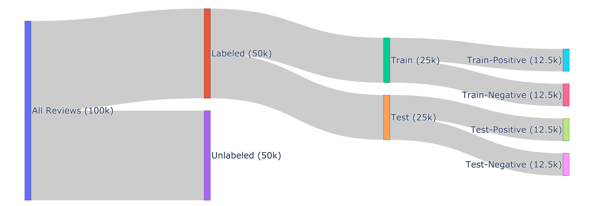

# Sentiment Classification of Movie Reviews

Contact:  
**Pooria daneshvar Kakhaki**  
Email: [daneshvarkakhaki.p@northeastern.edu](mailto:daneshvarkakhaki.p@northeastern.edu)  Department of Computer Science, Northeastern University, Boston, MA

**Neda Ghohabi Esfahani**  
Email: [ghohabiesfahani.n@northeastern.edu](mailto:ghohabiesfahani.n@northeastern.edu) Department of Bioengineering, Northeastern University

## Table of Contents

- [Introduction](#introduction)
- [Dataset](#dataset)
- [Environment](#environment)


## Introduction: 

This project focuses on sentiment analysis of movie reviews using the [IMDb Large Movie Review Dataset](https://www.kaggle.com/datasets/lakshmi25npathi/imdb-dataset-of-50k-movie-reviews?datasetId=134715&sortBy=dateRun&tab=profile), which consists of 50,000 reviews evenly split between positive and negative sentiments. We investigate a wide range of machine learning and deep learning approaches, including classical models (Logistic Regression, Random Forest with Bag-of-Words and TF-IDF), Fully Connected Networks and LSTMs with various word embeddings, and Transformer-based architectures such as DistilBERT and RoBERTa. Models were evaluated using accuracy, F1-score, precision, and recall, offering a comprehensive comparison across embedding strategies, fine-tuning techniques, and model complexities for sentiment classification.

## Dataset
We use the Large Movie Review Dataset (IMDb), which contains 100,000 movie reviews, including 50,000 labeled examples and 50,000 unlabeled examples.  The labeled portion is evenly split into a training set and a test set, each with 25,000 reviews (12,500 positive and 12,500 negative). The unlabeled reviews, typically used for clustering or zero-shot tasks, are excluded from all experiments in this project. Since no predefined validation split is provided, we reserve 20% of the training data for validation. This results in 20,000 training samples (10,000 positive, 10,000 negative) and 5,000 validation samples (2,500 positive, 2,500 negative).

To download and prepared the dataset, run the following script:

```shell
pip prepare_dataset.py
```

## Environment

Prepare the virtual environment:

You can use the provided `requirements.py` file:
```shell
pip install -r requirements.txt
```

Otherwise, you we need the following packages:

```shell
# Core Python Libraries
numpy
pandas
scikit-learn
argparse

# Deep Learning
torch
torchvision
torchaudio

# Transformers (Hugging Face)
transformers
datasets

# Tokenization Utils
sentencepiece

# Plotting and Visualization
matplotlib
seaborn
wordcloud

# Word2Vec
gensim

# Text Processing
nltk
joblib
symspellpy

# Training Utilities
tqdm
```

## Methodology
### Preprocessing:
We applied text normalization techniques including lowercasing, HTML and URL removal, stopword filtering, punctuation removal, and lemmatization. Spell correction was also used to reduce noise. Preprocessing was implemented with NLTK, regular expressions, and SymSpell.

Text Representation:
We explored multiple input representations, including:
Bag-of-Words (binary and count) and TF-IDF for classical models.
Word embeddings, including pretrained Word2Vec, domain-trained Word2Vec, and randomly initialized embeddings.
Native tokenizers (WordPiece, Byte-Pair Encoding) for Transformer models.

## Modeling Approaches

### Classical ML models
Logistic Regression, Random Forest.

### Deep learning models
Fully Connected Networks (FCNs), Recurrent Neural Networks (RNNs), and Long Short-Term Memory Networks (LSTMs).

### Transformer models
Custom Transformers trained from scratch and fine-tuned pretrained models (DistilBERT, RoBERTa), using various fine-tuning strategies.
Evaluation:
Model performance was evaluated primarily using accuracy, along with F1-score, precision, and recall, on the balanced IMDb test set.


